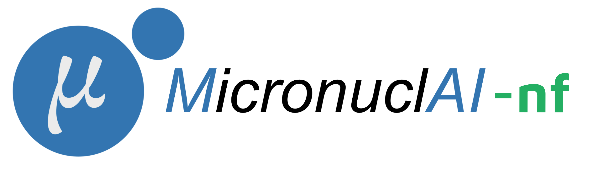
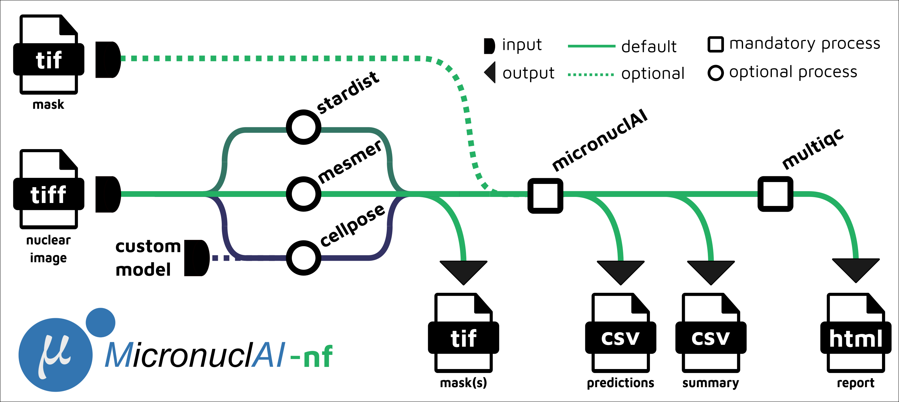

<h1>
  <picture>
    <source media="(prefers-color-scheme: light)" srcset="docs/images/micronuclAI_nf_logo.png">
    
  </picture>
</h1>

[](https://github.com/SchapiroLabor/micronuclAI_nf/actions/workflows/ci.yml)
[](https://github.com/SchapiroLabor/micronuclAI_nf/actions/workflows/linting.yml)[](https://nf-co.re/micronuclai/results)[](https://doi.org/10.1101/2024.05.24.595722)
[](https://www.nf-test.com)

[](https://www.nextflow.io/)
[](https://www.docker.com/)
[](https://sylabs.io/docs/)
[](https://cloud.seqera.io/launch?pipeline=https://github.com/nf-core/micronuclai)

[](https://twitter.com/nf_core)[](https://mstdn.science/@nf_core)[](https://www.youtube.com/c/nf-core)

## Introduction

**micronucAI_nf** is a best-practices Nextflow pipeline developed with nf-core tools and adhering to nf-core standards as a deployment of the micronuclAI tool for chromosomal instability detection (CIN) from high-resolution microscopy images. The pipeline allows users to go from images to CIN quantification report with multiple options provided for segmentation.

<p align="center">
    
</p>

1. Perform segmentation from the input image with a selected tool

- [Stardist](https://github.com/stardist/stardist)
- [Deepcell Mesmer](https://www.nature.com/articles/s41587-021-01094-0)
- [Cellpose](https://www.nature.com/articles/s41592-020-01018-x)

2. Predict micronuclei counts per cell ([micronuclAI](https://www.biorxiv.org/content/10.1101/2024.05.24.595722v1))
3. Present QC metrics per sample ([`MultiQC`](http://multiqc.info/))

## Usage

> [!NOTE]
> If you are new to Nextflow and nf-core, please refer to [this page](https://nf-co.re/docs/usage/installation) on how to set-up Nextflow. Make sure to [test your setup](https://nf-co.re/docs/usage/introduction#how-to-run-a-pipeline) with `-profile test` before running the workflow on actual data.

First, prepare a samplesheet with your input data that looks as follows:

`samplesheet.csv`:

```csv
sample,image
CONTROL1,control1_image.tif
TEST1,test1_image.tif
```

Each row represents a unique input image with the `sample` column value as a unique identifier.
The input image (2-dimensional nuclear image) has to be provided in the `image` column.

Now, you can run the pipeline using:

```bash
nextflow run SchapiroLabor/micronuclAI_nf \
    -profile <docker/singularity/.../institute> \
    --input samplesheet.csv \
    --outdir <OUTDIR>
```

Default pipeline run would take in an input `tif` files, run [Stardist](https://github.com/stardist/stardist) segmentation with the `2D_versatile_fluo` model, tiling the input images as a 3x3 grid, predicting the micronuclei counts with ['micronuclAI](https://www.biorxiv.org/content/10.1101/2024.05.24.595722v1) with crop size set to 256, resizing factor of 0.6, and an expansion of the FOV by 20. The produced summary metrics from the prediction are presented with the [`MultiQC`](http://multiqc.info/) report.

Optionally a pre-computed segmentation mask can be provided in the `segmentation` column (if provided, you need to use set `params.skip_segmentation = true`), otherwise segmentation will be computed by a provided segmentation tool.

`samplesheet_skip_seg.csv`:

```csv
sample,image,segmentation
CONTROL1,control1_image.tif,control1_mask.tif
TEST1,test1_image.tif,test1_mask.tif
```

In this case, you would run the pipeline using:

```bash
nextflow run SchapiroLabor/micronuclAI_nf \
    -profile <docker/singularity/.../institute> \
    --input samplesheet_skip_seg.csv \
    --skip_segmentation true \
    --outdir <OUTDIR>
```

> [!WARNING]
> Please provide pipeline parameters via the CLI or Nextflow `-params-file` option. Custom config files including those provided by the `-c` Nextflow option can be used to provide any configuration _**except for parameters**_;
> see [docs](https://nf-co.re/usage/configuration#custom-configuration-files).

For more details and further functionality, please refer to the [usage documentation](https://github.com/SchapiroLabor/micronuclAI_nf/blob/dev/docs/usage.md) and the [parameter documentation](https://github.com/SchapiroLabor/micronuclAI_nf/blob/dev/docs/parameters.md).

## Pipeline output

To see details about the output files and reports, please refer to the [output documentation](https://github.com/SchapiroLabor/micronuclAI_nf/blob/dev/docs/output.md).

## Credits

micronuclAI_nf was originally written by Miguel A. Ibarra-Arellano and Krešimir Beštak based on the tool micronuclAI developed by Miguel A. Ibarra-Arellano.

## Contributions and Support

If you would like to contribute to this pipeline, please see the [contributing guidelines](.github/CONTRIBUTING.md).

## Citations

If you use micronuclAI_nf for your analysis, please cite it using the following doi: [10.1101/2024.05.24.595722d](https://doi.org/10.1101/2024.05.24.595722d)

An extensive list of references for the tools used by the pipeline can be found in the [`CITATIONS.md`](CITATIONS.md) file.

You can cite the `nf-core` publication as follows:

> **The nf-core framework for community-curated bioinformatics pipelines.**
>
> Philip Ewels, Alexander Peltzer, Sven Fillinger, Harshil Patel, Johannes Alneberg, Andreas Wilm, Maxime Ulysse Garcia, Paolo Di Tommaso & Sven Nahnsen.
>
> _Nat Biotechnol._ 2020 Feb 13. doi: [10.1038/s41587-020-0439-x](https://dx.doi.org/10.1038/s41587-020-0439-x).
